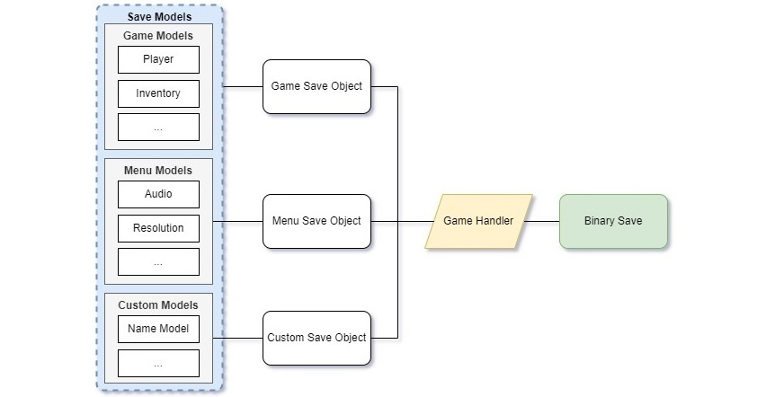

# Unity Binary Save Load
 Unity save system with binary formatter
<hr>
 
<hr>

# Example Of Use

## 1. Create a game model
```c#
[System.Serializable]
public class PlayerSave
{
    public int Life;
    public Vector LastPosition;
    public Rotation LastRotation;
}
```
## 2. Serialize classes to Game Save Object
```c#
[System.Serializable]
public class GameSaveObject 
{
    public PlayerSave Player = new PlayerSave(); // Work with a single class
    // public List<PlayerSave> ListPlayers = new List<PlayerSave>(); // Work with Lists
    // public Dictionary<string, PlayerSave> DictionaryPlayers = new Dictionary<string, PlayerSave>(); // Work with Dictionaries
}
```
## 3. Save and Load
```c#
public class GameHandler : MonoBehaviour
{
    private void Update()
    {
        if (Input.GetKeyDown(KeyCode.S))
            Save();
        
        if (Input.GetKeyDown(KeyCode.L))
            Load();
    }

    public void Save()
    {
        // Loading the last save, if it does not exist, an empty save is created by default
        GameSaveObject gameSave = BinarySave.Load<GameSaveObject>(BinarySave.DEFAULT_GAME_SAVE);

        // Class to be saved
        PlayerSave player = new PlayerSave
        {
            Life = Random.Range(0, 100),
            LastPosition = BinarySave.SerializeVector(transform.position),
            LastRotation = BinarySave.SerializeRotation(transform.rotation)
        };
        gameSave.Player = player;

        // Save
        BinarySave.Save(BinarySave.DEFAULT_GAME_SAVE, gameSave);
    }

    public void Load()
    {
        // Loading the last save, if it does not exist, an empty save is created by default
        GameSaveObject gameSave = BinarySave.Load<GameSaveObject>(BinarySave.DEFAULT_GAME_SAVE);
        // Configuring and applying data written to a single instance
        PlayerSave playerSave = gameSave.Player;
    }
}
```
# Save Vectors and Quaternions
Binary Save cannot save Vector and Quaternions type data. For this, we have to use methods that convert to the Vector and Rotation structs of the BinarySave class.

```c#
[System.Serializable]
public class MyModelSave
{
    public Vector Position;
    public Vector Euler;
    public Rotation Rotation;
}

public void Save()
{
    MyModelSave model = new MyModelSave();
    model.Position = BinarySave.SerializeVector(transform.position);
    model.Euler = BinarySave.SerializeVector(transform.eulerAngles);
    model.Rotation = BinarySave.SerializeRotation(transform.rotation);

    // Rest of code
}
```